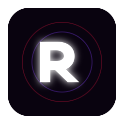
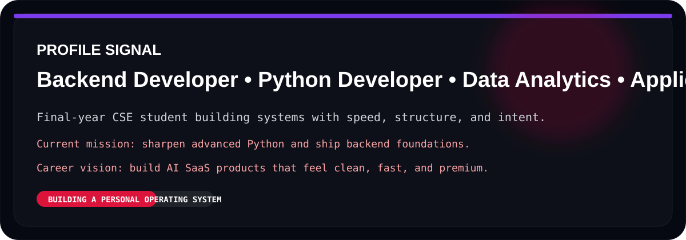
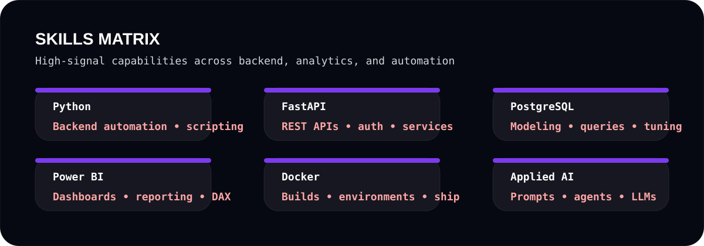
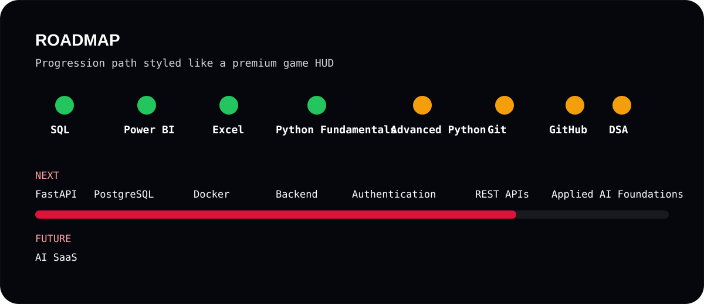
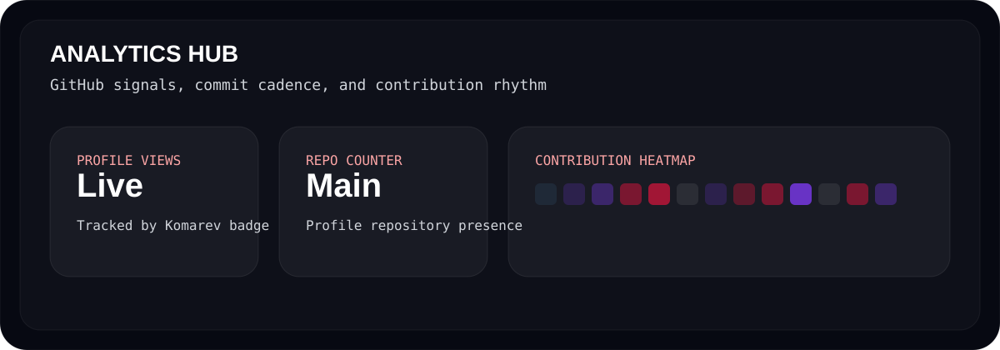
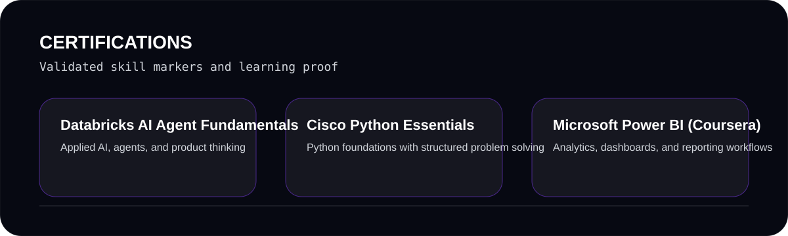

<div align="center">



<a href="https://git.io/typing-svg"></a>

<br>


</div>

<br>




<div>




## Hero Mission

Premium backend, analytics, and AI systems built with structure, speed, and intent.

Current mission: sharpen advanced Python, ship backend foundations, and turn data workflows into product-level interfaces.

Career vision: build AI SaaS products that look clean, feel fast, and scale without noise.

### `> current status`

- Backend systems
- Python engineering
- Analytics workflows
- Applied AI foundations

### `> whoami`

```js
const trinay = {
  name: "Trinay Sai Chadalavada",
  handle: "@trinay126",
  role: "Final-year CSE Student",
  focus: [
    "Backend Engineering",
    "Python Development",
    "Data Analytics",
    "Applied AI"
  ],
  currentStack: ["Advanced Python", "FastAPI", "PostgreSQL", "Docker"],
  strengths: ["SQL", "Power BI", "Excel", "Problem Solving"],
  goal: "Build AI SaaS products",
  contact: "thrinaychadalavada@gmail.com"
};
```

```text
sql         ████████████████████░░  90%
power bi    ████████████████████░░  90%
excel       ████████████████████░░  90%
python      ████████████████░░░░░░  80%
git         ████████████░░░░░░░░░░  60%
fastapi     ██████░░░░░░░░░░░░░░░░  30%
postgres    █████░░░░░░░░░░░░░░░░░  25%
docker      █████░░░░░░░░░░░░░░░░░  25%
ai          ██████░░░░░░░░░░░░░░░░  30%
```

<pre>
┌─────────────────────────────────────────────────────┐
│  Final Year CSE Student (2027)                      │
│  Backend engineering · analytics · applied AI       │
│                                                     │
│  Current stack                                      │
│  Python · FastAPI · PostgreSQL · Docker             │
│                                                     │
│  Objective                                          │
│  Build AI SaaS products                             │
└─────────────────────────────────────────────────────┘
</pre>

> trinay126 · thrinaychadalavada@gmail.com · built to ship

</div>




## `> stack core`

<table>
<tr>
<td width="50%">

### Languages

<p>

</p>

- Python for backend and automation
- JavaScript for web logic
- HTML and CSS for UI structure and styling

</td>
<td width="50%">

### Backend & Data

<p>

</p>

- FastAPI for APIs
- PostgreSQL for data systems
- Docker for shipping environments
- Git and GitHub for workflow discipline

</td>
</tr>
</table>




## `> focus map`




## `> visual dashboard`




<div align="center">


</div>


## `> motion artifacts`

<div align="center">

<picture>
  <source media="(prefers-color-scheme: dark)" srcset="./dist/github-snake-dark.svg" />
  <source media="(prefers-color-scheme: light)" srcset="./dist/github-snake.svg" />
  
</picture>


</div>

## `> current focus`

- Advanced Python
- Git and GitHub
- DSA
- Backend Fundamentals
- Problem Solving


## `> certifications`



## `> repository activity`

<div align="center">


</div>


## `> connect`

<p align="center">
<a href="https://github.com/trinay126"></a>
<a href="mailto:thrinaychadalavada@gmail.com"></a>
</p>

<div align="center">

> build systems. solve problems. keep learning.


</div>
